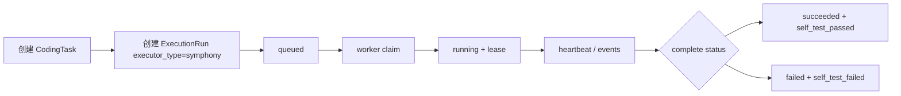

# Symphony Bridge S0/S1 实施记录

本文记录当前阶段已经落地的 Symphony Bridge 最小实现，后续接真实 Symphony daemon、Codex runner、MR 和部署时以此为入口继续扩展。

## 1. S0 结论

- `https://github.com/openai/symphony.git` 的远端 HEAD 可访问，当前探测到 `fecbc92a1590dd46c4bcb9df31c76f4824e8caf1`。
- 尝试把源码 clone 到 `.runtime/symphony-src` 时，网络在传输包体阶段被重置，未形成可运行本地副本。
- `.runtime/` 已在 `.gitignore` 中，后续拉取 Symphony 源码或运行 daemon 不会进入项目版本控制。
- S0 暂不阻塞 S1：AI PJM 先实现自己的内部执行桥合同，真实 Symphony 只需要按合同消费任务和回写结果。

## 2. 当前已实现的 S1 合同

内部接口统一挂在：

```text
/api/v2/internal/symphony
```

所有接口都需要请求头：

```text
X-Symphony-Bridge-Token: <token>
```

后端配置项：

```text
SYMPHONY_BRIDGE_TOKEN=<内部 worker token>
SYMPHONY_BRIDGE_DEFAULT_LEASE_SECONDS=300
```

### Symphony Bridge 环境配置项

这些配置只影响内部 Symphony Bridge API 或可选的本地 worker。修改
`backend/.env` 后需要重启后端进程；修改 worker 环境变量后需要重启 worker。

| 配置项 | 默认值 | 作用 |
| --- | --- | --- |
| `SYMPHONY_BRIDGE_TOKEN` | 空 | 后端内部接口鉴权 token。为空时内部 Symphony Bridge API 不接受请求；worker 请求必须通过 `X-Symphony-Bridge-Token` 发送同值。 |
| `SYMPHONY_BRIDGE_DEFAULT_LEASE_SECONDS` | `300` | claim 或 heartbeat 未显式传入 `lease_seconds` 时，后端写入的默认租约秒数。 |
| `AI_PJM_API_BASE_URL` | `http://127.0.0.1:8010/api/v2` | `backend/scripts/symphony_worker.py` 连接的 AI PJM API 根地址，需要包含 `/api/v2`。 |
| `SYMPHONY_WORKER_ID` | `symphony-worker-<随机后缀>` | worker 标识，会写入 execution evidence，建议生产或长期运行环境使用稳定值。 |
| `SYMPHONY_WORKSPACE` | 当前工作目录 | worker 运行 runner command 和 required checks 的工作区。建议使用仓库根目录，便于按仓库相对路径回写 changed files。 |
| `SYMPHONY_WORKER_RUNTIME_DIR` | `.runtime/symphony-worker` | worker 保存 task package 和 prompt 文件的本地运行目录。 |
| `SYMPHONY_WORKER_STATUS_FILE` | 空 | 可选 JSON 状态文件路径；通过启动脚本运行时默认写入 `.runtime/symphony-worker/worker-status.json`。 |
| `SYMPHONY_RUNNER_COMMAND` | 空 | 可选本地执行命令模板。支持 `{run_id}`、`{workspace}`、`{workspace_q}`、`{task_package_file}`、`{task_package_file_q}`、`{task_prompt_file}`、`{task_prompt_file_q}`。 |
| `SYMPHONY_WORKER_COMMAND_TIMEOUT_SECONDS` | `1800` | worker 执行 runner command 和 required checks 时，每条本地命令的超时时间。 |
| `SYMPHONY_WORKER_LEASE_SECONDS` | `2100` | worker claim 和 heartbeat 时请求的租约秒数。默认比命令超时多 300 秒。 |
| `SYMPHONY_WORKER_POLL_SECONDS` | `5` | worker 使用 `--loop` 时，队列为空后的轮询间隔秒数。 |

命令行参数优先级高于 worker 环境变量；后端运行时只读取
`SYMPHONY_BRIDGE_TOKEN` 和 `SYMPHONY_BRIDGE_DEFAULT_LEASE_SECONDS`。

已实现接口：

```text
GET  /api/v2/internal/symphony/execution-runs
GET  /api/v2/internal/symphony/execution-runs/{run_id}/task-package
POST /api/v2/internal/symphony/execution-runs/{run_id}/claim
POST /api/v2/internal/symphony/execution-runs/{run_id}/heartbeat
POST /api/v2/internal/symphony/execution-runs/{run_id}/events
POST /api/v2/internal/symphony/execution-runs/{run_id}/complete
```

当前只允许 `executor_type = "symphony"` 的 `ExecutionRun` 被内部 worker 领取，避免外部 worker 误消费已有 `codex` 执行任务。

## 3. 状态流转



`claim` 使用 `run_id + queued` 条件更新，避免同一个 queued run 被多个 worker 重复领取。领取成功后写入：

- `ExecutionRun.status = running`
- `CodingTask.status = running`
- `ExecutionRun.evidence_json.symphony_bridge.worker_id`
- `claimed_at`
- `lease_expires_at`

`complete` 回写后由 AI PJM 落库最终状态，并写入 `self_test_passed` 门禁。Symphony 不直接决定业务门禁，只提交执行证据。

即使 worker 上报 `status=succeeded`，AI PJM 也会重新校验：

- `evidence.command_results` 必须包含所有 `required_checks`，且 `status=passed`、`exit_code=0`。
- `evidence.changed_files` 不能超出 `allowed_paths`。
- 当任务期望包含 changed files 证据时，`evidence.changed_files` 不能为空；Codex 进程返回 0 但未实际改文件不视为成功。
- 校验失败时，最终 `ExecutionRun.status` 会被降级为 `failed`，并在 `evidence_json.dispatch.bridge_validation` 中记录原因。

## 4. 任务包内容

`task-package` 当前返回最小执行上下文：

- run、coding task、demand 标识
- 风险等级
- task prompt
- allowed paths
- forbidden actions
- required checks
- expected evidence
- acceptance criteria
- repo context summary
- impact summary
- 当前 execution evidence

接口不会返回明文密钥。事件、summary、evidence 在入库前会经过脱敏。

## 5. 手工验证方式

1. 配置内部 token：

```powershell
$env:SYMPHONY_BRIDGE_TOKEN="dev-bridge-token"
```

2. 通过普通交付接口创建一个 `executor_type=symphony` 的执行记录。

3. 查询队列：

```powershell
curl.exe -H "X-Symphony-Bridge-Token: dev-bridge-token" `
  http://127.0.0.1:8010/api/v2/internal/symphony/execution-runs
```

4. 领取任务：

```powershell
curl.exe -X POST `
  -H "Content-Type: application/json" `
  -H "X-Symphony-Bridge-Token: dev-bridge-token" `
  -d "{\"worker_id\":\"worker-a\",\"lease_seconds\":300}" `
  http://127.0.0.1:8010/api/v2/internal/symphony/execution-runs/<run_id>/claim
```

5. 回写完成：

```powershell
curl.exe -X POST `
  -H "Content-Type: application/json" `
  -H "X-Symphony-Bridge-Token: dev-bridge-token" `
  -d "{\"worker_id\":\"worker-a\",\"status\":\"succeeded\",\"summary\":\"Required checks passed.\",\"evidence\":{\"changed_files\":[\"backend/app/example.py\"],\"command_results\":[{\"command\":\"python -m compileall app\",\"status\":\"passed\",\"exit_code\":0}]}}" `
  http://127.0.0.1:8010/api/v2/internal/symphony/execution-runs/<run_id>/complete
```

## 6. 自动化验证

当前已覆盖：

```powershell
cd backend
python -m pytest tests/test_delivery_v2.py::test_symphony_bridge_claim_event_heartbeat_and_complete -q
python -m pytest tests/test_delivery_v2_units.py tests/test_delivery_v2.py tests/test_auth.py tests/test_health.py -q
```

测试覆盖：

- 未带 token 不允许访问内部接口
- 只返回 `executor_type=symphony` 的 queued run
- `/dispatch` 对 `executor_type=symphony` 保持 queued，等待 worker claim
- pause 后 run 不再被 worker claim，resume 后重新进入 queued
- cancel 后 run 进入 cancelled，worker late complete 会被拒绝
- 同一 coding task 已有 queued/running/paused run 时，重复创建会返回现有 active run
- task package 可读取执行上下文
- claim 后状态进入 running
- 重复 claim 被拒绝
- event 和 complete evidence 会脱敏
- heartbeat 会刷新 lease
- lease 过期的 running run 会被恢复为 failed，避免永久卡住
- complete 会写入最终 run 状态和 self-test gate

## 7. 下一步

S2 已完成首版：`get_execution_executor("symphony")` 会返回 `SymphonyBridgeExecutor`。`/api/v2/execution-runs/{id}/dispatch` 对 `executor_type=symphony` 的 run 只做后台投递记录，保持 `queued`，不会退回本地检查执行器，也不会在 HTTP 请求里长时间运行。最终成功或失败只能由 worker 通过 `/complete` 回写后由 AI PJM 校验决定。内部队列查询会顺手恢复 lease 过期的 running run，将其标记为 failed 并保留 worker、lease 和恢复时间证据。

当前也已经增加一个最小命令行 worker：

```text
backend/scripts/symphony_worker.py
```

它负责：

- 轮询 `/internal/symphony/execution-runs`
- claim 后读取 task package
- 调用本地 runner command
- 周期性 heartbeat
- 事件流写回 events
- required checks 完成后调用 complete

如果真实 Symphony 本地 clone 仍不稳定，可以先实现一个最小 `symphony-worker` 命令行适配器，按相同 API 合同跑通本地 Codex 命令，再替换底层执行引擎。

示例：

```powershell
cd backend
$env:SYMPHONY_BRIDGE_TOKEN="dev-bridge-token"
python scripts/symphony_worker.py `
  --api-base-url http://127.0.0.1:8010/api/v2 `
  --workspace "D:\projects\AI PJM" `
  --runner-command "powershell -NoProfile -ExecutionPolicy Bypass -File {workspace_q}\scripts\run-codex-task.ps1 -PromptFile {task_prompt_file_q} -WorkspaceRoot {workspace_q}"
```

`--workspace` 建议使用项目根目录，这样 changed files 会以仓库相对路径回写，AI PJM 才能准确校验 allowed paths。required checks 会按常见命令自动选择 `backend` 或 `frontend` 子目录运行。
路径里包含空格时，runner command 应优先使用 `{workspace_q}`、`{task_prompt_file_q}`、`{task_package_file_q}` 这类已转义占位符。

启动 worker 前可先做本地 runner 模板验证。该命令默认不调用 AI，只检查推荐 Codex 命令模板、占位符展开和 Codex CLI 是否可用：

```powershell
.\scripts\check-symphony-runner.ps1 -UseRecommendedCodexCommand -RequireCodex
```

后续接真实 Symphony 时，优先把 `--runner-command` 替换为 Symphony/Codex 的本地执行入口；不要让前端页面或 `/dispatch` HTTP 请求承担长任务执行。

## 8. 本地常驻 worker

本地开发和试点环境可以用独立脚本启动 worker，不把长任务塞进 FastAPI 进程：

```powershell
$env:SYMPHONY_BRIDGE_TOKEN="dev-bridge-token"
.\scripts\start-symphony-worker.ps1
```

常用参数：

```powershell
.\scripts\start-symphony-worker.ps1 `
  -ApiBaseUrl http://127.0.0.1:8010/api/v2 `
  -WorkerId symphony-worker-local `
  -Workspace "D:\projects\AI PJM" `
  -PollSeconds 5
```

如果希望启动前后端时同时启动 worker：

```powershell
$env:SYMPHONY_BRIDGE_TOKEN="dev-bridge-token"
.\scripts\start-dev.ps1 -WithWorker
```

停止 worker：

```powershell
.\scripts\stop-symphony-worker.ps1
```

`.\scripts\stop-dev.ps1` 也会同时停止 worker。运行时文件：

- PID：`.runtime/symphony-worker.pid`
- 状态：`.runtime/symphony-worker/worker-status.json`
- 日志：`.runtime/logs/symphony-worker.out.log` 和 `.runtime/logs/symphony-worker.err.log`

status 文件包含 `worker_id`、`state`、`run_id`、`message`、`workspace`、`updated_at`，用于本地确认 worker 是否 idle、running、succeeded 或 failed。
