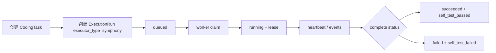

# Symphony Bridge S0/S1 实施记录

本文记录当前阶段已经落地的 Symphony Bridge 最小实现，后续接真实 Symphony daemon、Codex runner、MR 和部署时以此为入口继续扩展。

## 1. S0 结论

- `https://github.com/openai/symphony.git` 的远端 HEAD 可访问，当前探测到 `fecbc92a1590dd46c4bcb9df31c76f4824e8caf1`。
- 尝试把源码 clone 到 `.runtime/symphony-src` 时，网络在传输包体阶段被重置，未形成可运行本地副本。
- `.runtime/` 已在 `.gitignore` 中，后续拉取 Symphony 源码或运行 daemon 不会进入项目版本控制。
- S0 暂不阻塞 S1：AI PJM 先实现自己的内部执行桥合同，真实 Symphony 只需要按合同消费任务和回写结果。

## 2. 当前已实现的 S1 合同

内部接口统一挂在：

```text
/api/v2/internal/symphony
```

所有接口都需要请求头：

```text
X-Symphony-Bridge-Token: <token>
```

后端配置项：

```text
SYMPHONY_BRIDGE_TOKEN=<内部 worker token>
SYMPHONY_BRIDGE_DEFAULT_LEASE_SECONDS=300
```

已实现接口：

```text
GET  /api/v2/internal/symphony/execution-runs
GET  /api/v2/internal/symphony/execution-runs/{run_id}/task-package
POST /api/v2/internal/symphony/execution-runs/{run_id}/claim
POST /api/v2/internal/symphony/execution-runs/{run_id}/heartbeat
POST /api/v2/internal/symphony/execution-runs/{run_id}/events
POST /api/v2/internal/symphony/execution-runs/{run_id}/complete
```

当前只允许 `executor_type = "symphony"` 的 `ExecutionRun` 被内部 worker 领取，避免外部 worker 误消费已有 `codex` 执行任务。

## 3. 状态流转



`claim` 使用 `run_id + queued` 条件更新，避免同一个 queued run 被多个 worker 重复领取。领取成功后写入：

- `ExecutionRun.status = running`
- `CodingTask.status = running`
- `ExecutionRun.evidence_json.symphony_bridge.worker_id`
- `claimed_at`
- `lease_expires_at`

`complete` 回写后由 AI PJM 落库最终状态，并写入 `self_test_passed` 门禁。Symphony 不直接决定业务门禁，只提交执行证据。

## 4. 任务包内容

`task-package` 当前返回最小执行上下文：

- run、coding task、demand 标识
- 风险等级
- task prompt
- allowed paths
- forbidden actions
- required checks
- expected evidence
- acceptance criteria
- repo context summary
- impact summary
- 当前 execution evidence

接口不会返回明文密钥。事件、summary、evidence 在入库前会经过脱敏。

## 5. 手工验证方式

1. 配置内部 token：

```powershell
$env:SYMPHONY_BRIDGE_TOKEN="dev-bridge-token"
```

2. 通过普通交付接口创建一个 `executor_type=symphony` 的执行记录。

3. 查询队列：

```powershell
curl.exe -H "X-Symphony-Bridge-Token: dev-bridge-token" `
  http://127.0.0.1:8010/api/v2/internal/symphony/execution-runs
```

4. 领取任务：

```powershell
curl.exe -X POST `
  -H "Content-Type: application/json" `
  -H "X-Symphony-Bridge-Token: dev-bridge-token" `
  -d "{\"worker_id\":\"worker-a\",\"lease_seconds\":300}" `
  http://127.0.0.1:8010/api/v2/internal/symphony/execution-runs/<run_id>/claim
```

5. 回写完成：

```powershell
curl.exe -X POST `
  -H "Content-Type: application/json" `
  -H "X-Symphony-Bridge-Token: dev-bridge-token" `
  -d "{\"worker_id\":\"worker-a\",\"status\":\"succeeded\",\"summary\":\"Required checks passed.\",\"evidence\":{\"checks\":[{\"command\":\"npm run build\",\"status\":\"passed\"}]}}" `
  http://127.0.0.1:8010/api/v2/internal/symphony/execution-runs/<run_id>/complete
```

## 6. 自动化验证

当前已覆盖：

```powershell
cd backend
python -m pytest tests/test_delivery_v2.py::test_symphony_bridge_claim_event_heartbeat_and_complete -q
python -m pytest tests/test_delivery_v2_units.py tests/test_delivery_v2.py tests/test_auth.py tests/test_health.py -q
```

测试覆盖：

- 未带 token 不允许访问内部接口
- 只返回 `executor_type=symphony` 的 queued run
- task package 可读取执行上下文
- claim 后状态进入 running
- 重复 claim 被拒绝
- event 和 complete evidence 会脱敏
- heartbeat 会刷新 lease
- complete 会写入最终 run 状态和 self-test gate

## 7. 下一步

S2 不应把 Symphony 执行塞回现有 HTTP dispatch 长请求。当前已经增加一个最小命令行 worker：

```text
backend/scripts/symphony_worker.py
```

它负责：

- 轮询 `/internal/symphony/execution-runs`
- claim 后读取 task package
- 调用本地 runner command
- 周期性 heartbeat
- 事件流写回 events
- required checks 完成后调用 complete

如果真实 Symphony 本地 clone 仍不稳定，可以先实现一个最小 `symphony-worker` 命令行适配器，按相同 API 合同跑通本地 Codex 命令，再替换底层执行引擎。

示例：

```powershell
cd backend
$env:SYMPHONY_BRIDGE_TOKEN="dev-bridge-token"
python scripts/symphony_worker.py `
  --api-base-url http://127.0.0.1:8010/api/v2 `
  --workspace "D:\projects\AI PJM\backend" `
  --runner-command "python -m compileall app"
```

后续接真实 Symphony 时，优先把 `--runner-command` 替换为 Symphony/Codex 的本地执行入口；不要让前端页面或 `/dispatch` HTTP 请求承担长任务执行。
