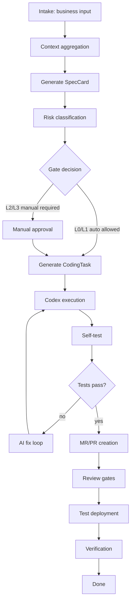

# AI PJM v2 Delivery Blueprint

## 1. Product Positioning

AI PJM v2 is an AI delivery orchestration platform.

It is not a generic project management tool, and it is not a replacement for Codex. Its role is to turn business input into an auditable engineering delivery flow:

```text
business input
-> context aggregation
-> user story and spec
-> implementation plan
-> Codex task package
-> coding execution
-> self-test and fix loop
-> MR/PR
-> test deployment
-> human or automatic verification
-> archive
```

## 2. Design Principles

- Automate low-risk, repeatable work by default.
- Keep hard gates for safety, irreversible changes, production, and ambiguous business decisions.
- Treat AI output as a draft until it passes evidence-backed checks.
- Keep workflow state in the platform, not in prompts.
- Keep AI providers, Dify workflows, and Codex execution pluggable.
- Preserve a complete evidence trail for each state transition.

## 3. Non-goals for the First Stage

- No multi-repository orchestration.
- No default multi-agent review.
- No automatic production merge or production deployment.
- No complex knowledge graph.
- No production-grade executor, MR/PR, deployment, or verification automation in the first cut.

## 4. Main Workflow



## 5. Domain Model Baseline

| Model | Purpose |
| --- | --- |
| `DemandItem` | Raw business input and normalized demand metadata. |
| `SpecCard` | User story, scope, acceptance criteria, risks, and constraints. |
| `RepoContext` | Project, repository, target branch, base branch, modules, and test commands. |
| `ImpactAnalysis` | Code impact, dependency impact, delivery risk, and confidence score. |
| `CodingTask` | Codex-ready task package with allowed scope, constraints, and required checks. |
| `ExecutionRun` | One execution attempt by Codex or another executor. |
| `GateCheck` | Hard gate result with decision, reason, and evidence. |
| `MergeRequestRecord` | MR/PR metadata, review status, and links. |
| `DeployRecord` | Test deployment metadata and environment URL. |
| `VerificationRecord` | Human or automatic verification conclusion. |

## 6. Risk Levels

| Level | Automation Policy | Examples |
| --- | --- | --- |
| `L0` | Fully automatic if tests pass. | Copy, style, tests, small low-risk fixes. |
| `L1` | Automatic execution, notify before MR or deployment when configured. | Small feature or single-module change. |
| `L2` | Manual spec or plan approval required before execution. | DB migration, permissions, core flow, cross-module change. |
| `L3` | Manual approval required and auto-merge/deploy disabled. | Production data, payment, security, secrets, irreversible operation. |

## 7. Hard Gates

Minimum gates for v2:

- `spec_ready`: Spec contains user story, acceptance criteria, scope, and constraints.
- `risk_classified`: Risk level and reason are recorded.
- `repo_context_ready`: Repository, base branch, target branch strategy, and test commands are known.
- `execution_allowed`: The risk policy allows automated execution or a manual approval exists.
- `self_test_passed`: Required tests and checks passed.
- `review_passed`: Blocking review issues are resolved.
- `test_deployed`: A test environment is available when required.
- `verification_passed`: Human or automatic verification is complete.

## 8. AI Provider Boundary

AI workflows may be implemented by local mock logic, Dify, OpenAI APIs, or another provider. They must return structured outputs and cannot directly mutate workflow state.

The platform owns:

- state transitions
- gate checks
- audit and evidence logs
- executor dispatch
- credentials and permissions

The AI workflow owns:

- summaries
- user stories
- spec drafts
- impact analysis drafts
- implementation plan drafts
- test plan drafts
- Codex task package drafts

## 9. First Implementation Slice

The current implementation slice establishes the main backend framework:

```text
DemandItem
-> SpecCard draft
-> risk classification
-> RepoContext draft
-> ImpactAnalysis draft
-> CodingTask package draft
-> ExecutionRun dispatch with local check evidence
```

Current boundaries:

- Provider boundary exists with a deterministic `mock` provider.
- Gate engine owns risk, confidence, and execution decisions.
- Local required-check execution is implemented for safe commands such as `npm run build`, `pytest`, `python -m pytest`, and `python -m compileall`.
- Dify/OpenAI providers are not implemented yet.
- Real Codex code execution, MR creation, deployment, and verification are separate follow-up slices.
