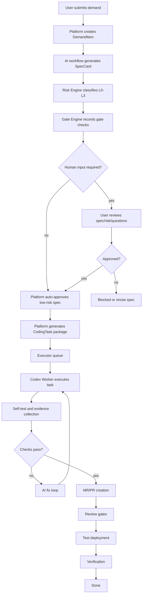

# AI PJM v2 Interaction Flow

This document describes the user-facing interaction flow and the platform automation behind it.

## 1. Interaction Goal

The user should not operate every internal step. The platform should keep moving automatically when risk and evidence allow it, and only stop for human input when a hard gate requires it.

The intended interaction model is:

```text
user provides business input
-> platform generates spec, risk, gates, and task package
-> platform asks for human input only when needed
-> platform executes and records evidence
-> user reviews evidence and verifies business result
```

## 2. Primary User Journey



## 3. Human Touchpoints

Human interaction should be limited to these cases:

| Touchpoint | Required When | User Action |
| --- | --- | --- |
| Demand clarification | AI confidence is low or acceptance boundary is unclear. | Answer focused questions. |
| Spec approval | Risk is `L2` or `L3`, or automation policy disables auto-approval. | Approve, reject, or revise SpecCard. |
| Execution approval | Change touches protected areas such as auth, payment, secrets, production data, or migrations. | Explicitly approve execution scope. |
| Verification | Test environment is deployed and business acceptance is required. | Pass/fail against acceptance criteria. |
| Production release | Production deployment or irreversible operation is involved. | Explicit release approval. |

## 4. Automated Steps

The platform should automate these steps when gates pass:

- Generate demand summary and title.
- Generate SpecCard.
- Classify risk.
- Record `spec_ready` and `risk_classified` gates.
- Generate Codex-ready CodingTask.
- Dispatch Codex execution.
- Run required checks.
- Retry AI fix loop when checks fail.
- Create MR/PR.
- Collect review, test, and deployment evidence.

## 5. Current Implementation Status

The v2 delivery framework is now fully implemented with all 8 core entities and complete API endpoints:

### Core Data Models (Complete)
```text
DemandItem        # Raw business demand
-> SpecCard        # Engineering specification
-> GateCheck       # Hard gate evaluation results
-> RepoContext     # Repository context collection
-> ImpactAnalysis  # Code impact analysis
-> CodingTask      # Codex-ready task package
-> ExecutionRun    # Executor run attempts
-> ExecutionLog    # Structured execution logs
```

### API Endpoints (Complete)
```text
POST /api/v2/demands                        # Create demand
GET  /api/v2/demands/{demand_id}            # Get demand detail with artifacts
POST /api/v2/demands/{demand_id}/spec       # Generate spec card
GET  /api/v2/spec-cards/{spec_card_id}      # Get spec card
POST /api/v2/demands/{demand_id}/repo-context           # Collect repository context
GET  /api/v2/repo-contexts/{repo_context_id}           # Get repository context
POST /api/v2/demands/{demand_id}/impact-analysis       # Analyze impact
GET  /api/v2/impact-analyses/{impact_analysis_id}      # Get impact analysis
POST /api/v2/spec-cards/{spec_card_id}/coding-task     # Create coding task
GET  /api/v2/coding-tasks/{coding_task_id}             # Get coding task
POST /api/v2/coding-tasks/{coding_task_id}/runs        # Create execution run
GET  /api/v2/execution-runs/{execution_run_id}        # Get execution run
POST /api/v2/execution-runs/{execution_run_id}/dispatch # Dispatch execution
GET  /health                                  # Health check
```

### Gate Engine (Complete)
- Risk classification: L0 (low), L1 (normal), L2 (high), L3 (critical)
- Confidence estimation based on input quality
- Automated spec approval for low-risk demands
- Manual review requirements for high-risk changes
- Execution gate blocking for unsafe operations
- Repository context sufficiency evaluation

### Provider Architecture (Complete)
- Provider interface contracts defined
- Mock provider implemented (default)
- Provider factory for future Dify/OpenAI integration
- All providers return structured drafts only
- Backend maintains state and gate control

### Executor Architecture (Complete)
- Executor interface contracts defined
- LocalChecksExecutor implemented
- Safe command execution (pytest, npm build, compileall)
- Execution evidence collection and persistence
- Support for future Codex worker integration

### Automation Status (Complete)
- ✅ Low-risk auto-approval flow
- ✅ High-risk manual review flow
- ✅ Gate check persistence
- ✅ Repository context collection
- ✅ Impact analysis generation
- ✅ Coding task packaging
- ✅ Execution run creation with gate checks
- ✅ Local command execution and evidence collection
- ✅ Self-test passed gate evaluation

### Frontend Implementation (Complete)
- ✅ Complete TypeScript type definitions
- ✅ API client library
- ✅ DeliveryV2Page with 6-step workflow UI
- ✅ Real-time pipeline visualization
- ✅ Evidence and results display
- ✅ Error handling and status tracking

### Future Enhancements (Not Implemented)
- ⏳ Real Codex AI worker integration
- ⏳ MR/PR creation automation
- ⏳ Test deployment workflow
- ⏳ Business verification flow
- ⏳ Dify/OpenAI provider implementations

Current API path:

```text
POST /api/v2/demands
POST /api/v2/demands/{demand_id}/spec
POST /api/v2/demands/{demand_id}/repo-context
GET  /api/v2/repo-contexts/{repo_context_id}
POST /api/v2/demands/{demand_id}/impact-analysis
GET  /api/v2/impact-analyses/{impact_analysis_id}
POST /api/v2/spec-cards/{spec_card_id}/coding-task
POST /api/v2/coding-tasks/{coding_task_id}/runs
POST /api/v2/execution-runs/{execution_run_id}/dispatch
GET  /api/v2/execution-runs/{execution_run_id}
GET  /api/v2/demands/{demand_id}
```

Current automation:

- Low-risk or normal-risk demand can auto-approve SpecCard.
- High-risk demand enters manual review.
- Gate checks are persisted for `spec_ready` and `risk_classified`.
- Repo context can be collected through the configured workflow provider.
- Impact analysis can be generated from the latest SpecCard and RepoContext.
- CodingTask is generated as `ready` only when risk and spec status allow it.
- ExecutionRun is created as `queued` only when `execution_allowed` passes.
- ExecutionRun is created as `blocked` when the gate requires manual input.
- Queued ExecutionRun can be dispatched through the local required-check executor.
- Required check results are persisted as execution evidence and `self_test_passed` gate checks.

Not implemented yet:

- Real Codex execution worker.
- MR/PR creation.
- Test deployment.
- Verification workflow.

Provider status:

- `mock` provider is implemented and is the default.
- Dify/OpenAI providers are represented by the provider boundary but are not implemented yet.
- Workflow providers return structured drafts only; platform state and gates are owned by the backend.

## 6. UI Flow Target

The v2 UI should use a single progressive task screen:

```text
1. Intake
   - raw input
   - source type
   - optional requester/context

2. Spec and Risk
   - generated SpecCard
   - risk level
   - confidence score
   - open questions
   - gate results

3. Coding Task
   - Codex task prompt
   - allowed paths
   - forbidden actions
   - required checks
   - expected evidence

4. Execution
   - execution status
   - log stream
   - test results
   - changed files

5. Delivery
   - MR/PR link
   - test environment URL
   - verification result
```

## 7. Evidence Display

Each step must show why the platform moved forward:

- AI output version or provider.
- Risk decision and reason.
- Gate status.
- Test command and result.
- MR/PR URL.
- Deployment URL.
- Verification conclusion.
